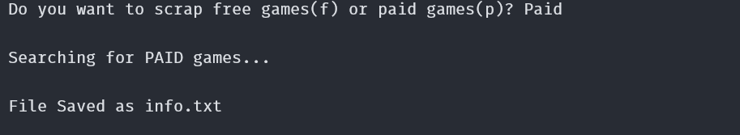

# web-scraping

Learned the very basics of Web Scraping and used the Python's [BeautifulSoup](https://www.crummy.com/software/BeautifulSoup/bs4/doc/) library to write a script that scrap the Home Page of Steam Store and store the result in a text file.

### Screenshot

### Resources that I found useful

- [What is Web Scraping?](https://www.geeksforgeeks.org/what-is-web-scraping-and-how-to-use-it/)
- [Python BeautifulSoup Tutorial](https://www.youtube.com/watch?v=XVv6mJpFOb0)
